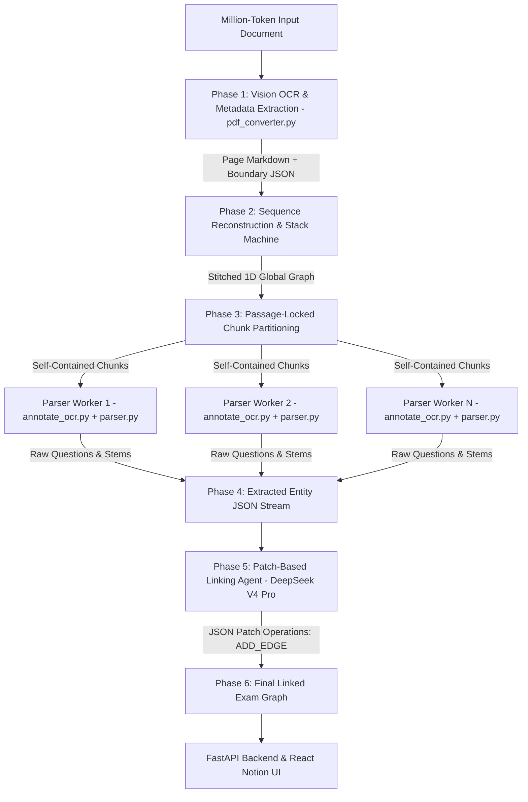

# Long-Context Parser Architecture Plan (Azozo Engine v2.0)

> **Goal**: Parse extremely long documents (100 to 20,000+ pages / 1M – 10M+ tokens) such as PDF exams, textbooks, and prep workbooks with **100% structural precision**, **zero text corruption**, and ultra-low cost (**$3.66 per 10M tokens**).

---

## 1. High-Level Architecture Overview



---

## 2. Integration of Existing Azozo Parser Stack

The new Long-Context Parser Agent is built directly on top of our existing, proven parser codebase:

1. **`backend/real_data_annotator/pdf_converter.py`**:
   - Executes parallel multi-page Vision OCR (`Minimax-M3`) and emits page text + `<|page_metadata|>` JSON headers.
2. **`backend/real_data_annotator/annotate_ocr.py`**:
   - `OCRAnnotator`: Performs sequence labeling using XML tag dictionary (`<question>`, `<stem>`, `<option_label>`, `<option_text>`, `<stimulus>`).
   - `parse_xml_annotations(tagged_text)`: Extracts character offset spans and tag parameters (`stimulus_id="..."`).
3. **`backend/app/services/parser.py`**:
   - `parse_spans_into_structured_questions(raw_text, spans)`: Deterministically compiles raw character spans into structured question objects in pure Python.
   - `regex_parse_questions(raw_text)`: Instant zero-cost regex fallback parser.

---

## 3. The 5 Core Pipeline Steps

```
[ Input PDF ] 
     │
     ▼
┌─────────────────────────────────────────────────────────────────────────┐
│ STEP 1: Vision OCR & Page Metadata Mining (pdf_converter.py)            │
│ • Runs parallel OCR (Minimax-M3) on page images.                        │
│ • Emits Page Markdown AND a 30-token boundary header (<|page_metadata|>).│
└─────────────────────────────────────────────────────────────────────────┘
     │
     ▼
┌─────────────────────────────────────────────────────────────────────────┐
│ STEP 2: Global Sequence Reconstruction (State Stack Machine)            │
│ • Connects page boundary headers in linear page order (Page 1..N).       │
│ • Identifies atomic Context-Question Groups (Passage + Q1..Qk).         │
└─────────────────────────────────────────────────────────────────────────┘
     │
     ▼
┌─────────────────────────────────────────────────────────────────────────┐
│ STEP 3: Passage-Locked Chunk Partitioning (greedy_chunker.py)           │
│ • Partitions pages into ~25k token chunks.                              │
│ • Never cuts inside an active passage or question (0% split risk).     │
└─────────────────────────────────────────────────────────────────────────┘
     │
     ▼
┌─────────────────────────────────────────────────────────────────────────┐
│ STEP 4: Parallel Text Extraction (Parser Agent Swarm)                   │
│ • Prompts OCRAnnotator (annotate_ocr.py) using DeepSeek V4 Flash.       │
│ • Executes parse_xml_annotations() to extract character spans.          │
│ • Calls parse_spans_into_structured_questions() (parser.py).           │
│ • Regex fallback via regex_parse_questions() on LLM failure.            │
└─────────────────────────────────────────────────────────────────────────┘
     │
     ▼
┌─────────────────────────────────────────────────────────────────────────┐
│ STEP 5: Patch-Based Context & Answer Linking (Graph Resolver Agent)     │
│ • Takes lightweight candidate summaries (IDs, page numbers, snippets).  │
│ • DeepSeek V4 Pro emits compact JSON patch operations (ADD_EDGE).       │
│ • Python mutates raw questions in-memory (98% cheaper linking pass).    │
└─────────────────────────────────────────────────────────────────────────┘
     │
     ▼
[ Verified Linked Exam Graph JSON ]
```

---

## 4. Data Flow Example (From Raw Page to Final Graph)

### Step 1 Output: Page Metadata Header (`<|page_metadata|>`)
During OCR, `Minimax-M3` returns page text plus a 30-token boundary header for every page:

```json
<|page_metadata|>
{
  "p": 14,
  "head": "CONT_GROUP",
  "tail": "OPEN_STEM",
  "seq": [
    ["STIM_START", "stim_passage2"],
    ["Q_START", "15"],
    ["Q_END", "15"],
    ["Q_START", "16"],
    ["OPEN_STEM", "16"]
  ]
}
```

---

### Step 4 Output: Raw Extracted Question (Parser Swarm via `parser.py`)
Parser Workers use `annotate_ocr.py` XML annotation and `parser.py` span processing to build clean JSON **without attempting to link distant passages**:

```json
{
  "id": "doc_bio12:sec_calculus:p14:q15",
  "question_number": "Câu 15",
  "stem": "Tính tích phân $I = \\int_{0}^{1} x e^x dx$.",
  "options": [
    {"label": "A", "text": "$I = 1$"},
    {"label": "B", "text": "$I = e - 1$"},
    {"label": "C", "text": "$I = e$"},
    {"label": "D", "text": "$I = 2e$"}
  ],
  "context_id": null
}
```

---

### Step 5 Input & Output: Patch-Based Linking

#### Input sent to Graph Resolver Agent (Lightweight Candidates Only):
```json
{
  "contexts": [
    {"id": "doc_bio12:sec_calculus:p14:stim_passage2", "page": 14, "snippet": "Đoạn văn 2: Tích phân từng phần..."}
  ],
  "questions": [
    {"id": "doc_bio12:sec_calculus:p14:q15", "printed_num": "15", "page": 14, "snippet": "Tính tích phân I..."}
  ],
  "solutions": [
    {"printed_num": "15", "page": 300, "answer": "A", "explanation": "Sử dụng công thức tích phân từng phần..."}
  ]
}
```

#### Output generated by Graph Resolver Agent (~30 tokens of JSON Patches):
```json
[
  {"op": "ADD_EDGE", "q_id": "doc_bio12:sec_calculus:p14:q15", "context_id": "doc_bio12:sec_calculus:p14:stim_passage2", "confidence": 0.99},
  {"op": "SET_ANSWER", "q_id": "doc_bio12:sec_calculus:p14:q15", "answer": "A", "explanation": "Sử dụng công thức tích phân từng phần..."}
]
```

#### Final Merged Result (Executed in Python In-Memory):
```json
{
  "id": "doc_bio12:sec_calculus:p14:q15",
  "question_number": "Câu 15",
  "stem": "Tính tích phân $I = \\int_{0}^{1} x e^x dx$.",
  "options": [...],
  "context_id": "doc_bio12:sec_calculus:p14:stim_passage2",
  "correct_answer": "A",
  "explanation": "Sử dụng công thức tích phân từng phần..."
}
```

---

## 5. Key Python Implementations

### 5.1 Parser Worker Composition (`parser_agent_worker.py`)

```python
from backend.real_data_annotator.annotate_ocr import OCRAnnotator, parse_xml_annotations
from backend.app.services.parser import parse_spans_into_structured_questions, regex_parse_questions

class ParserAgentWorker:
    """
    Parser Agent Worker leveraging existing annotate_ocr.py and parser.py functions.
    Extracts structured questions from raw chunk text without attempting graph linking.
    """
    def __init__(self, model: str = "deepseek-chat", provider: str = "deepseek"):
        self.annotator = OCRAnnotator(model=model, provider=provider)

    def process_chunk(self, raw_chunk_text: str) -> dict:
        try:
            # 1. Run LLM XML annotation via annotate_ocr.py
            annotation_res = self.annotator.annotate_text(raw_chunk_text)
            
            # 2. Parse character spans into structured question objects via parser.py
            structured_questions, stimuli = parse_spans_into_structured_questions(
                annotation_res["raw_text"], annotation_res["spans"]
            )
            return {"questions": structured_questions, "stimuli": stimuli, "method": "llm_xml"}
            
        except Exception as e:
            # 3. Fallback to instant regex parser on failure
            print(f"[Parser Worker Fallback] Using regex parser: {e}")
            structured_questions = regex_parse_questions(raw_chunk_text)
            return {"questions": structured_questions, "stimuli": {}, "method": "regex_fallback"}
```

---

### 5.2 State Machine Reconstruction (`DocumentStateStack`)

```python
class DocumentStateStack:
    """
    Stitches page boundary headers into atomic Context-Question groups.
    Runs in O(N) linear time.
    """
    def __init__(self, doc_id: str):
        self.doc_id = doc_id
        self.stack = []
        self.completed_groups = []
        self.current_section = "global"

    def process_metadata_stream(self, page_metadata_stream: list) -> list:
        for meta in sorted(page_metadata_stream, key=lambda x: x["p"]):
            page_num = meta["p"]

            if meta["head"] == "CONT_GROUP" and self.stack:
                self.stack[-1]["pages"].append(page_num)

            for event in meta["seq"]:
                event_type = event[0]
                if event_type == "STIM_START":
                    stim_id = f"{self.doc_id}:{self.current_section}:p{page_num}:{event[1]}"
                    self.stack.append({"group_id": stim_id, "pages": [page_num], "questions": []})
                elif event_type == "Q_START" and self.stack:
                    q_id = f"{self.doc_id}:{self.current_section}:p{page_num}:q{event[1]}"
                    self.stack[-1]["questions"].append(q_id)

            if meta["tail"] == "CLEAN" and self.stack:
                closed_group = self.stack.pop()
                closed_group["status"] = "CLOSED"
                self.completed_groups.append(closed_group)

        while self.stack:
            self.completed_groups.append(self.stack.pop())
        return self.completed_groups
```

---

### 5.3 Passage-Locked Partitioning (`greedy_oversize_chunker`)

```python
def greedy_oversize_chunker(page_metadata_list: list, target_tokens: int = 25000, max_tokens: int = 35000) -> list:
    chunks = []
    current_chunk = []
    current_tokens = 0

    for page in page_metadata_list:
        current_chunk.append(page)
        current_tokens += page.get("estimated_tokens", 500)

        if current_tokens >= target_tokens:
            is_in_group = page["tail"] in ("OPEN_GROUP", "OPEN_THEORY")

            if not is_in_group or current_tokens >= max_tokens:
                chunks.append(current_chunk)
                current_chunk = []
                current_tokens = 0

    if current_chunk:
        chunks.append(current_chunk)

    return chunks
```

---

## 6. Cost Breakdown per 10 Million Tokens (~20,000 Pages)

| Pipeline Stage | Model Used | Input Cost | Output Cost | Total Stage Cost |
| :--- | :--- | :--- | :--- | :--- |
| **Parser Swarm** *(Text & LaTeX Extraction)* | **DeepSeek V4 Flash** | $1.401<br>($0.14/1M) | $1.820<br>($0.28/1M) | **$3.221** |
| **Patch-Based Graph Resolver** | **DeepSeek V4 Pro** | $0.348<br>($0.435/1M) | $0.087<br>($0.87/1M) | **$0.435** |
| **Total 10M Token Pipeline** | — | **$1.749** | **$1.907** | **$3.66 USD** |

*Cost per page: **$0.00018** (less than 1/50th of a cent per page).*

---

## 7. Production System Prompts for Pipeline Agents

### 7.1 OCR Agent System Prompt (`Minimax-M3`)

```
You are an expert Document OCR and Structural Layout Mining Assistant.
Your task is to transcribe the provided document page image into clean, structured Markdown AND emit a compact page boundary JSON header.

CRITICAL USABILITY RULES (Usability over Visual Reproduction):
1. NO ARTIFICIAL SPACING OR VISUAL REPRODUCTION: Do NOT attempt to visually replicate physical layout using spaces, tabs, or multiple consecutive empty spaces. Do NOT use whitespace to simulate multi-column layouts, align numbers under gaps, or pad text to match physical margins. Prioritize clean, usable text over visual reproduction.
2. Single-Column Merging: Merge multi-column layouts into a single-column linear flow following logical reading order.
3. LaTeX Normalization: Convert all mathematical variables, formulas, and inline equations into standard LaTeX ($...$ for inline, $$...$$ for block formulas).
4. Page Metadata Header: At the VERY END of your response, output a strict JSON block enclosed in <|page_metadata|> ... <|end_metadata|>.
```

JSON Metadata Schema Rules:
- "p": Integer page number.
- "head": Top boundary state ("CLEAN", "CONT_GROUP", "CONT_THEORY").
- "tail": Bottom boundary state ("CLEAN", "OPEN_GROUP", "OPEN_THEORY", "OPEN_STEM", "OPEN_OPT").
- "seq": Ordered array of top-to-bottom page events:
  - ["THEORY_START", section_name]
  - ["WORKED_EX", example_title]
  - ["STIM_START", stimulus_id]
  - ["Q_START", question_number]
  - ["Q_END", question_number]

Example Output:
# Section 1.2 Dynamics
Theory text here with formula $F = ma$...

<|page_metadata|>
{
  "p": 14,
  "head": "CONT_THEORY",
  "tail": "OPEN_STEM",
  "seq": [
    ["THEORY_START", "1.2 Dynamics"],
    ["STIM_START", "stim_passage1"],
    ["Q_START", "15"],
    ["Q_END", "15"],
    ["Q_START", "16"]
  ]
}
<|end_metadata|>
```

---

### 7.2 Parser Agent System Prompt (`SYSTEM_PROMPT` in `annotate_ocr.py`)

Uses the existing, battle-tested system prompt from `backend/real_data_annotator/annotate_ocr.py`:
- Emits inline XML tags (`<question>`, `<stem>`, `<option_label>`, `<option_text>`, `<stimulus>`, `<section>`, `<explanation>`).
- Enforces 100% literal text preservation without paraphrasing or character omission.
- Emits `<|END|>` upon chunk completion.

---

### 7.3 Compact Graph Resolver System Prompt (`DeepSeek V4 Pro`)

```
You are a Specialized Entity Resolution and Graph Linker Agent.
Your task is to analyze candidate summaries of Questions, Context Blocks, and Answer Keys, and emit lightweight JSON patch operations to link entities.

STRICT OUTPUT FORMAT RULES:
1. Output ONLY a valid JSON array of patch operations.
2. DO NOT re-emit question stems, option text, or passage prose.
3. Allowed Patch Operations:
   - {"op": "ADD_EDGE", "q_id": "...", "context_id": "...", "confidence": 0.99}
   - {"op": "SET_ANSWER", "q_id": "...", "answer": "A", "explanation": "..."}

Matching Rules:
- If a question contains an implicit trigger like "đoạn văn trên" or "according to passage 1", link it to the corresponding candidate context.
- Match answer keys from solution grids on appendix pages to their corresponding question IDs.

Example Output:
[
  {"op": "ADD_EDGE", "q_id": "doc1:p14:q15", "context_id": "doc1:p14:stim_1", "confidence": 0.99},
  {"op": "SET_ANSWER", "q_id": "doc1:p14:q15", "answer": "B", "explanation": "Explanation text..."}
]
```
